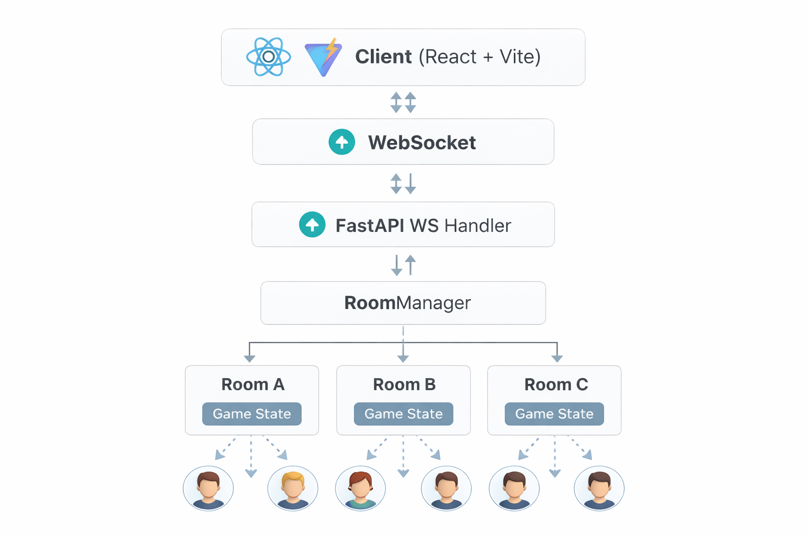

# Bluff

Real-time multiplayer implementation of the classic **Bluff / Cheat** card game.  
Built with **FastAPI, WebSockets, React, Vite, and TypeScript**.


---


---

# Play Online

https://bluff-murex.vercel.app

Note: The API runs on **Render free tier**, so cold starts can take a few seconds.

---

# Table of Contents

- About
- Why I Built This
- How the Game Works
- Tech Stack
- Architecture
- Running Locally
- Dev Simulation
- Project Structure
- Documentation
- Current Bugs and Limitations
- Roadmap
- Contributing
- License

---

# About

Bluff is one of my favorite card games to play in real life. It has been responsible for many chaotic, funny, and occasionally intense moments with roommates and family. The whole game revolves around reading people, bluffing confidently, and deciding when to call someone out.

So I built it online.

This project is a **real-time multiplayer implementation** of the classic Bluff card game.  
Players interact through **WebSockets**, which allows every action to propagate instantly across all connected clients.

The project is still a **work in progress**. Most of the intended functionality exists, but there may still be some bugs or unfinished UI elements.

---

# Why I Built This

Bluff has always been one of those games that turns a quiet evening into complete chaos. The mix of deception, probability, and reading other players makes it incredibly fun.

I wanted to recreate that experience online and experiment with building a **real-time multiplayer system using WebSockets**.

The goal of this project was not just to build the game itself, but also to explore:

- Real-time multiplayer architecture
- Game state synchronization
- WebSocket communication patterns
- Lightweight deployment of multiplayer services

---

# How the Game Works

Bluff is easy to learn but becomes very interesting once players start lying.

Ideally there are **four players**, but the game works with more or fewer. When creating a room you can choose to play with **one or two decks**.

Cards are distributed equally among players.  
Each player can see their own cards, but no one else’s.

The **first player begins**.

On their turn they:

- Place one or more cards face down
- Announce what they are playing

Examples:

- Three Kings
- Two Fours
- One Ace

In theory, all cards played in a turn must be the **same rank**.  
However the player may **lie or tell the truth**.

With a single deck there are only **four cards of each rank** (eight if two decks are used).  
So if someone claims something like **“ten Aces”**, someone is obviously lying.

Other players can:

- Play the same rank
- Pass
- Call **Bluff**

When someone calls bluff, the caller must **select one of the last player’s cards blindly**.

If the selected card is a **lie**, the player who played the cards picks up the entire pile.

If the card is **truthful**, the caller picks up the entire pile.

There are many variations of Bluff rules, but I prefer this one because the **blind selection adds a luck element** that makes the moment more dramatic.

The first player to **get rid of all cards wins**, but the game continues until **only one player remains with cards**.

---

# Tech Stack

Backend

- FastAPI
- Python 3.11
- WebSockets

Frontend

- React
- Vite
- TypeScript

Deployment

- Vercel (frontend)
- Render (backend)

---

# Architecture



Example message flow:

Client → WebSocket → FastAPI → Game Engine → Broadcast to all players

Game state is currently stored **in-memory**, meaning server restarts reset all rooms.

---

# Running Locally

Backend

```
python -m venv .venv
source .venv/bin/activate
pip install -r backend/requirements.txt
uvicorn backend.main:app --reload --port 8000
```

Health check:

```
curl http://127.0.0.1:8000/health
```

Expected response:

```
{"status":"ok"}
```

Frontend

```
cd frontend
npm install
npm run dev
```

Open the URL printed by Vite (usually):

```
http://127.0.0.1:5173
```

Optional WebSocket override:

```
VITE_WS_URL=ws://127.0.0.1:8000/ws npm run dev
```

---

# Dev Simulation

For automated game simulations without the UI:

```
python -m backend.dev_simulation --players 4 --games 3 --deck-count 1
```

For development-only WebSocket automation:

```
BLUFFER_DEV_MODE=1 uvicorn backend.main:app --reload --port 8000
```

---

# Project Structure

```
backend/
  main.py           FastAPI app + WebSocket handler
  rooms.py          Room lifecycle, deck creation, dealing logic
  game_engine.py    Core game rules and state machine

frontend/
  src/
    App.tsx
    screens/
      Lobby.tsx
      Game.tsx
    types/messages.ts
  public/cards/     SVG card assets

docs/
  API.md
  ARCHITECTURE.md
  GAMEPLAY.md
  UML.md
  WIREFRAME.md
```

---

# Documentation

docs/GAMEPLAY.md  
Full game rules and gameplay flow

docs/API.md  
HTTP + WebSocket message schema documentation

docs/ARCHITECTURE.md  
System design and internal structure

docs/UML.md  
UML diagrams (WIP)

docs/WIREFRAME.md  
UI layout references (WIP)

---

# Current Bugs and Limitations

- When a bluff call fails and the caller should pick up the entire pile, the UI message still reads as if only a single card was picked.
- Rooms exist **only in memory** (no persistence).
- Refreshing or restarting the server resets game state.
- API is currently **unauthenticated**.
- Some UI animations and spacing are still being tuned.

---

# Roadmap

Planned improvements:

- Automated tests and CI workflows
- Persistent game state
- Authentication
- Improved bluff-call card selection UI
- Replace placeholder audio
- Add mute toggle
- Add chat functionality
- UI polish and animation improvements

Completed improvements:

- Claim-rank dial with snapping and depth curve
- Refined HUD styling
- Updated Joker SVG assets
- Simplified connection status UI
- Global CSS cleanup for fullscreen layout

---

# Contributing

Contributions, bug reports, and feature suggestions are welcome.

If you notice a bug or have an idea for improvement, feel free to open an issue or submit a pull request.

---
