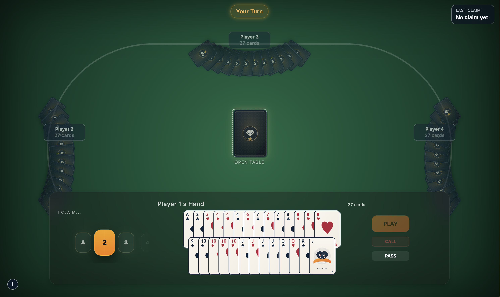

# Bluff



#### Playable link (hosted on Vercel + Render):  
 >>> https://bluff-murex.vercel.app  

> **Note:** Please excuse the long load times — this is running on the free tier of Render for API hosting.

---

## About

Bluff is one of my favorite card games to play in real life.  
It’s responsible for many funny, chaotic, and surprisingly intens moments with my roommates or family. You’re constantly guessing, lying confidently, and trying to read other players.  

So I built it online.  

This project is a real-time multiplayer version of the classic “Bluff" card game, powered by WebSockets so that every move updates instantly across all players  

This is built with:

- Backend: FastAPI + WebSocket
- Frontend: React + Vite + TypeScript

This project is currently a **work in progress**, although most of the intended functionality is implemented, there might be some uncaught bugs.

---

## How the Game Works

Bluff is simple to learn but very fun to play, here's how it goes.

Ideally 4 players, but the game works with more or fewer. You have the option to select 1 or 2 deck of cards in the room creation screen.

Cards are distributed equally among all players. Players can see their own cards, but no one can see anyone else’s cards.

The first player starts.

They:

- Place one or more cards face down in the middle.
- Announce what they’re playing.

For example:

- “Three Kings”
- “Two Fours”
- “One Ace”

In theory, all cards placed in a single turn must be of the same rank, but a player can lie or tell the truth.

Remember, for a single deck, there are only 4 of each cards. 8 for two decks. So it will be obvious to see who's lying when there are "10 x Aces" on the table. Who's lying?

Other players can play the same called card(s), pass and let it go or call “Bluff”.

If someone calls bluff, then out of the cards played by the last player, the caller needs to select a card blindly. If the selected card is a lie, then the other player picks up the pile. But if it is the card the player claimed it to be, then the caller picks up the entire pile.

(There are multiple variations to this rule, like revealing all the cards on calling bluff, but I feel like this is a better way as it introduces a luck factor in the game.)

The first player to get rid of all their cards wins. The game does not end on one player winning, the game just continues till there is only one player left with cards.

---

## Documentation Index (WIP)

- `docs/GAMEPLAY.md` — Full game rules and flow.
- `docs/API.md` — HTTP + WebSocket API reference with message schemas.
- `docs/ARCHITECTURE.md` — System architecture and code structure.
- `docs/UML.md` — UML diagrams (Mermaid).
- `docs/WIREFRAME.md` — Frontend wireframes and layout references.

---

## Requirements

- Python 3.11+
- Node.js 18+
- npm 9+

---

## Running Locally

### 1️⃣ Backend

From the repository root:

```bash
python -m venv .venv
source .venv/bin/activate
pip install -r backend/requirements.txt
uvicorn backend.main:app --reload --port 8000
```

Health check to confirm the API is running:

```bash
curl http://127.0.0.1:8000/health
```

Expected response:

```json
{"status":"ok"}
```

---

### 2️⃣ Frontend

In a separate terminal:

```bash
cd frontend
npm install
npm run dev
```

Open the URL printed by Vite (default: `http://127.0.0.1:5173`).

Optional WebSocket URL override:

```bash
VITE_WS_URL=ws://127.0.0.1:8000/ws npm run dev
```

---

## Dev Simulation (Hidden / Internal)

For automated testing runs (no UI):

```bash
python -m backend.dev_simulation --players 4 --games 3 --deck-count 1
```

For dev-only WebSocket automation:

```bash
BLUFFER_DEV_MODE=1 uvicorn backend.main:app --reload --port 8000
```

---

## Project Structure

```text
backend/
  main.py           # FastAPI app + WebSocket handler
  rooms.py          # Room lifecycle, deck build, dealing
  game_engine.py    # Core game rules and state machine

frontend/
  src/App.tsx       # Top-level UI and WebSocket integration
  src/screens/Lobby.tsx
  src/screens/Game.tsx
  src/types/messages.ts
  public/cards/     # SVG card assets

docs/
  *.md              # Project documentation
```

---

## Notes

- The UI and balancing values (card overlap, spacing, animations) are still being tuned.
- API is currently unauthenticated and room memory is in-process (no database).
- Designed as a real-time multiplayer experiment using WebSockets.

---

## Current Bugs and Limitations

- When a bluff call is wrong and the caller should pick up the whole pile, the message still reads like a single card was picked.
- Rooms are in-memory only (no persistence) and the API is unauthenticated.
- The game state is not persistant on cloud. Refresh or restart will loose all game progress.
- UI/animation tuning is ongoing and may change (dial behavior, spacing, animation timing).

---

## TODO

- Setup and Add tests and code analysis in workflows and actions
- Need to add How to Play page on landing site
- Add a mute button to mute all audio
- Right now, the game sounds are placeholders and not the final ones, will have to replace.
- Add chat functionality (or even voice chat - might be a bit too much)
- Improve the UI for bluff call card selection, currently uses the old prototype layout
- There are still some paceholder dev UI components and messagess remaining, will integrate them better, or remove them entirely.
- Game might not be fully optimized, so need working on that

- ~~Implemented the premium claim-rank dial (snap, depth curve, and input handling).~~
- ~~Refined the game HUD styling (fullscreen table, glass hand panel, action buttons, turn indicators, spacing).~~
- ~~Updated Joker SVGs (JOKER corners, gold finish, glow, removed bottom text).~~
- ~~Simplified connection status UI + repositioned the info icon.~~
- ~~Global CSS cleanup for a full-screen “canvas” feel (no scrollbars, unified background depth).~~
